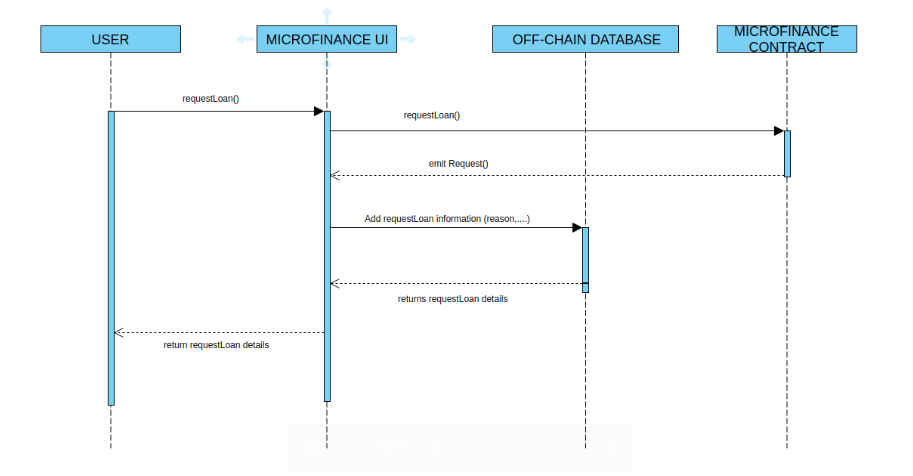
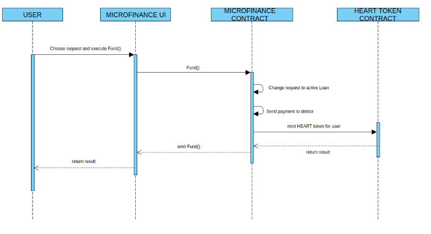
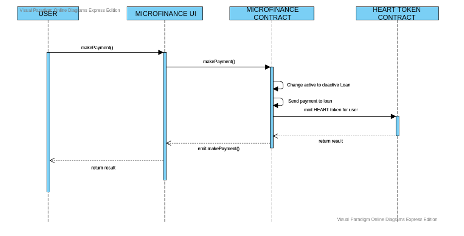
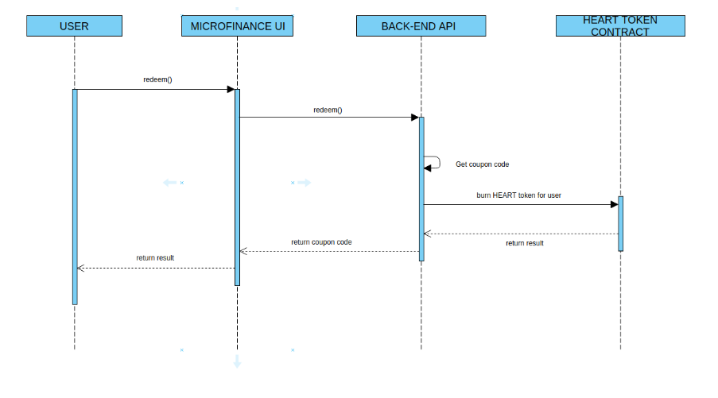
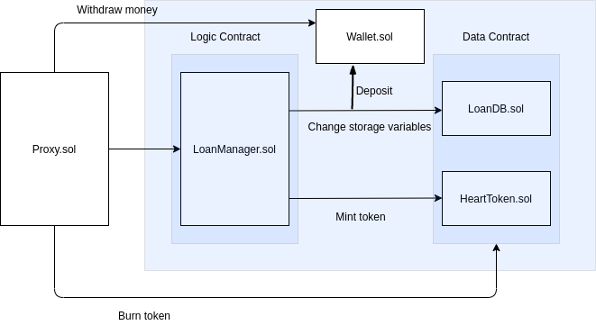

# DeMicroFi - Decentralized Micro Finance Loan - (DAPP2 Project in George Brown College)

DAPP that facilitates Loan Process, no-required third party based on Ethereum Network. It has a mecharnism to incentive good behaviour by giving users heart token which can be used to redeem coupon.
[DeMicroFi Pitch Presentation](https://slides.com/leodinh/deck)

## Author
Author: Nguyen Anh Tuan Dinh.

Student ID: 101201831.

## Demo

Live Demo: https://leodinh.github.io/microfinance-dapp/ .

Video Demo: https://youtu.be/mS9xzl6gmGc .

## Problem Statement

Microfinance is a banking service provided to unemployed or low-income individuals. People wants to build a platform that provides microfinance loan. However, they have to face with two main issues:

1. Expensive tranditional audit fee (The amount of loan is small,not worth it for tranditional audit).
2. Truthless intermediary.

## Proposed Solution

The emergence of Blockchain is a key to solve any intermediary-related problem. Lenders and Borrowers can communicate directly, all loan transactions are stored in immutable database.
The comparision of non-Blockchain and Blockchain solution :
| Non-Blockchain | Blockchain |
|----------------|------------|
| Expensive traditional audit process | Small amount of money for gas fee |
| Truthless intermediary company | No need third party |
| Transactions can be manipulated | Tranparent and secure transactions|

## DApp Architecture Design

### Technology

#### Ethereum

Ethereum is an open source, public, blockchain-based distributed computing platform and operating system featuring smart contract functionality.

#### ReactJS

React is a JavaScript library for building user interfaces. It is maintained by Facebook and a community of individual developers and companies. React can be used as a base in the development of single-page or mobile applications.

#### Firebase

Firebase is a mobile and web application development platform developed by Firebase.

### Modeling

The current design was made with assumption that sponsors already empowered DeMicroFi to use their coupon code.

#### Request Loan

#### Lend Loan

#### Pay Loan

#### Redeem coupon

## Data Storage

### On-Chain

- `LoanDB.sol`
  | Name | Type | Structure | Visibility | Purpose |
  |---------------|---------------|-------------------|-------------------|-----------|
  | `debt` | struct |{ address lender; address borrower;uint256 amountOfDebt;uint256 interest; uint8 loanState;} | N/A | Structure to store debt details |
  | `LoanState` | enum | {REQUESTED, FUNDED, PAID} | N/A | State of loan |
  | `debtInfo` | mapping | (bytes32 debtID=> debt) | private | mapping of debtID with the debt struct |
  | `debtHistory` | mapping | (address borrower => bytes32[] debtID) | private | mapping of borrower with debtID list |
  | `lendHistory` | mapping | (address lender => bytes32[] debtID) | private | mapping of lender with debtID list |
  | `haveDebt` | mapping | (address user => bool haveDebt) | private | checking user is having debt or not |

- `Wallet.sol`
  | Name | Type | Structure | Visibility | Purpose |
  |---------------|---------------|-------------------|-------------------|-----------|
  | `_deposits`| mapping | (address user => uint256 amount) | private | the amount of money that user has|

### Off-chain

All user information and debt details are stored in Firebase Database.

**/infor**

- name.
- address.
- phone.
- userAddr.

**/debt**

- amount.
- borrower.
- debtNo.
- reason.

**/coupon**

- product.
- productCode.
- userAddr.

## Smart Contract Architecture Design

### DeMicroFi contracts was designed based on upgradable pattern.

### DeMicroFi contracts

### Deployments

Network : Ropsten

Deployed Contract Addresses: [Link](./ropsten_deploy_info.txt)

Proxy Contract Address: [Link](https://ropsten.etherscan.io/address/0x6a961cd4488cbcf843e9d2d26a4b8f79bdd1e0bb)

## Goals

- [x] Blockchain

  - [x] Implemented contracts structure that can be upgraded.
  - [x] Created testcase for contracts.
  - [x] Implemented functions files for front-end in order to interact with Blockchain

- [ ] Front-end

  - [x] Finished necessary pages.
  - [x] Created responsive pages for mobile and tablet.
  - [x] Set up redux for global variables.
  - [ ] Test for Front-end.

- [ ] Back-end

  - [x] Implemented file that connects to Firebase database.
  - [x] Able to store off-chain data as per requirements.
  - [ ] Switch centralized database (Firebase) to decentralized database (IPFS).

- [x] CI/CD

  - [x] for contract testcases

## Resources

- [Inspiring Smart Contract Structure](https://github.com/swop-io/core-contracts)
- [Icon](https://www.flaticon.com/)
- [Inspiring Management React Folder Structure](https://www.udemy.com/course/react-the-complete-guide-incl-redux/learn/lecture/8226862#overview)
